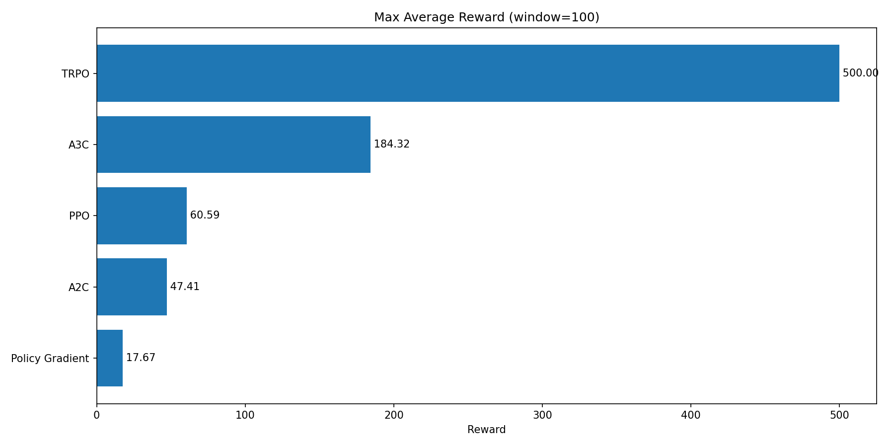
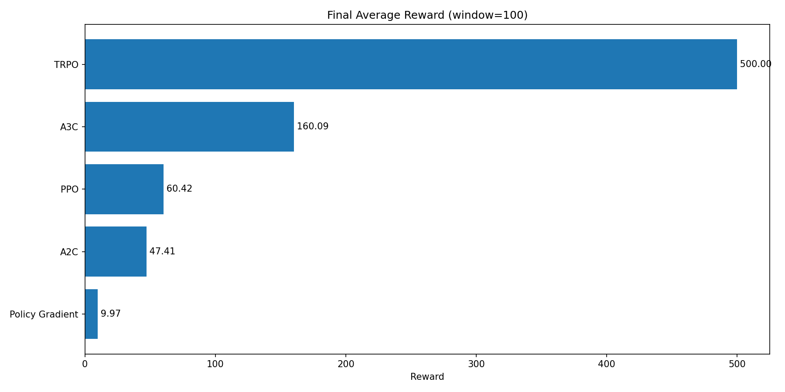
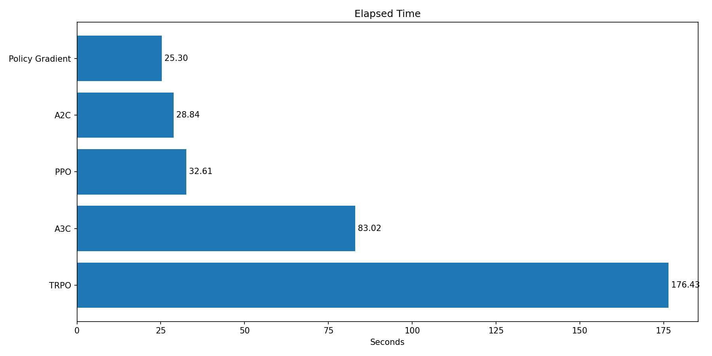
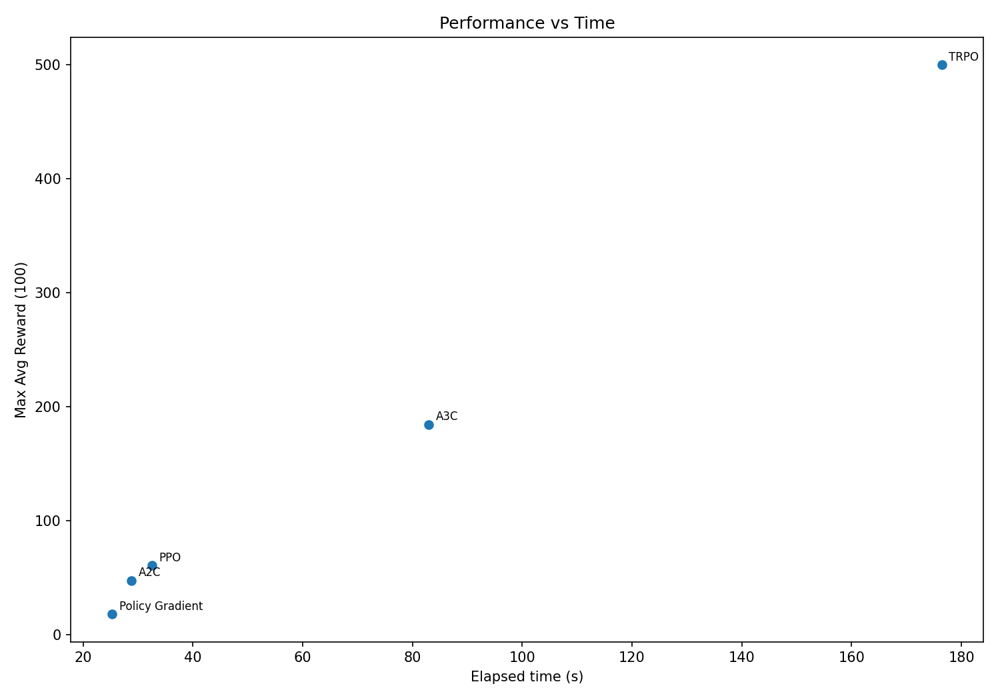

# RL Benchmark Aggregate Report

Source data: `outputs/aggregate_summary.json`
Total algorithms: **5**

## Leaderboard (by MaxAvg100)

| Rank | Algo | Runs | MaxAvg100 | FinalAvg100 | Time(s) | Efficiency |
|---:|---|---:|---:|---:|---:|---:|
| 1 | TRPO | 1 | 500.00 | 500.00 | 176.43 | 2.834 |
| 2 | A3C | 1 | 184.32 | 160.09 | 83.02 | 2.220 |
| 3 | PPO | 1 | 60.59 | 60.42 | 32.61 | 1.858 |
| 4 | A2C | 1 | 47.41 | 47.41 | 28.84 | 1.644 |
| 5 | Policy Gradient | 1 | 17.67 | 9.97 | 25.30 | 0.698 |

## Plots

## Key observations

- Top-3 by `max_avg_reward_100_mean`: **TRPO** (500.00), **A3C** (184.32), **PPO** (60.59)
- Bottom-3 by `max_avg_reward_100_mean`: **PPO** (60.59), **A2C** (47.41), **Policy Gradient** (17.67)
- Fastest method: **Policy Gradient** (25.30s)
- Slowest method: **TRPO** (176.43s)
- Median elapsed time across methods: **32.61s**

## Reproducibility note

Current summary appears to use single-run statistics (`runs=1` for each method), so standard deviations are zero. For robust comparisons, aggregate multiple seeds.
