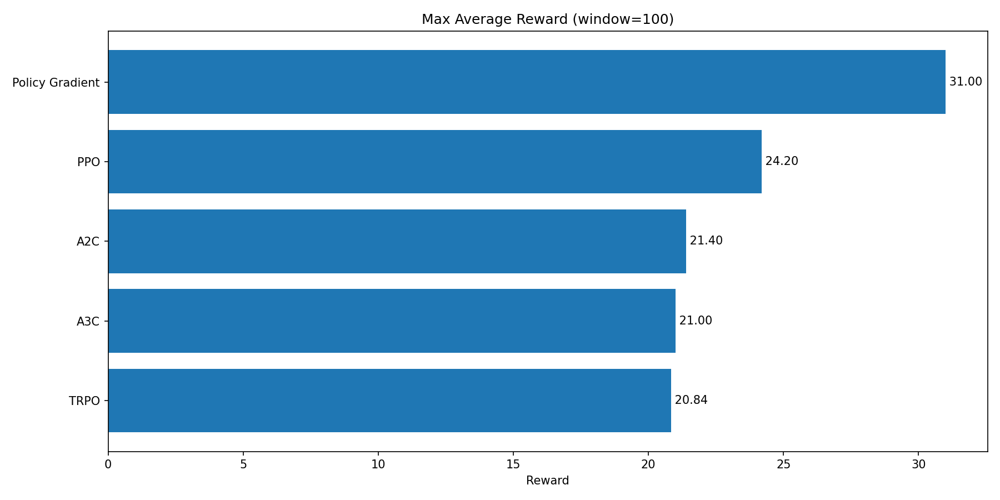
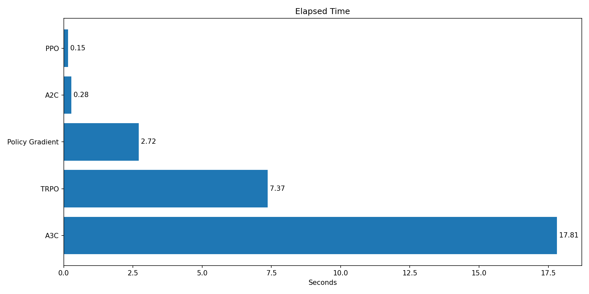
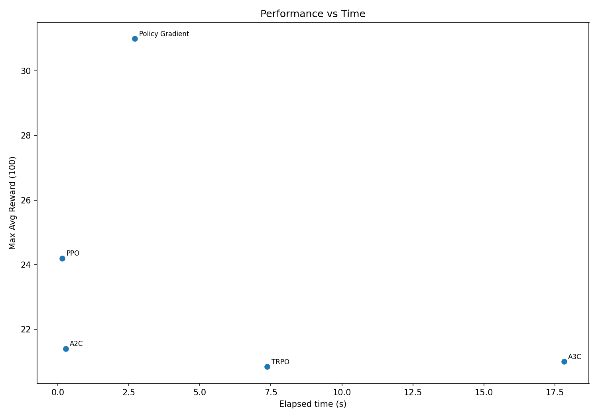

# RL Policy Optimization Smoke Aggregate Report

Source data: `outputs/smoke_policy5/aggregate_summary.json`
Total algorithms: **5**

## Leaderboard (by MaxAvg100)

| Rank | Algo | Runs | MaxAvg100 | FinalAvg100 | Time(s) | Efficiency |
|---:|---|---:|---:|---:|---:|---:|
| 1 | Policy Gradient | 1 | 31.00 | 31.00 | 2.72 | 11.414 |
| 2 | PPO | 1 | 24.20 | 24.20 | 0.15 | 158.048 |
| 3 | A2C | 1 | 21.40 | 21.40 | 0.28 | 77.718 |
| 4 | A3C | 1 | 21.00 | 21.00 | 17.81 | 1.179 |
| 5 | TRPO | 1 | 20.84 | 20.84 | 7.37 | 2.826 |

## Plots

## Key observations

- Top-3 by `max_avg_reward_100_mean`: **Policy Gradient** (31.00), **PPO** (24.20), **A2C** (21.40)
- Bottom-3 by `max_avg_reward_100_mean`: **A2C** (21.40), **A3C** (21.00), **TRPO** (20.84)
- Fastest method: **PPO** (0.15s)
- Slowest method: **A3C** (17.81s)
- Median elapsed time across methods: **2.72s**

## Reproducibility note

Current summary appears to use single-run statistics (`runs=1` for each method), so standard deviations are zero. For robust comparisons, aggregate multiple seeds.
